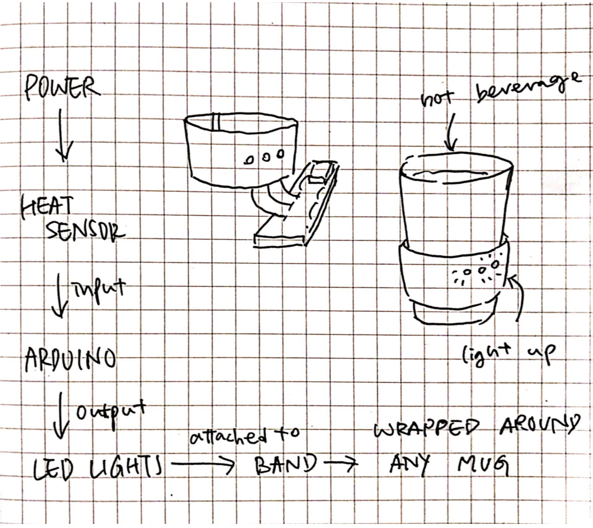
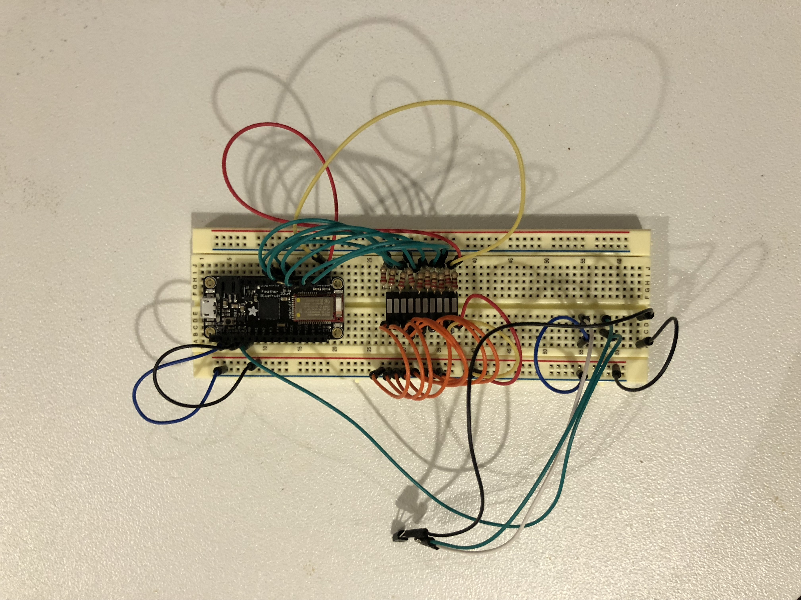
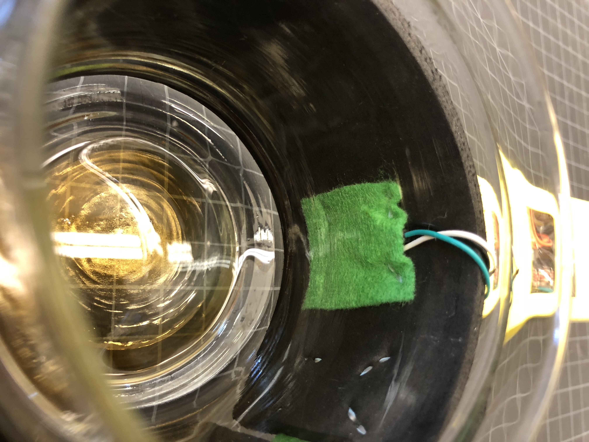
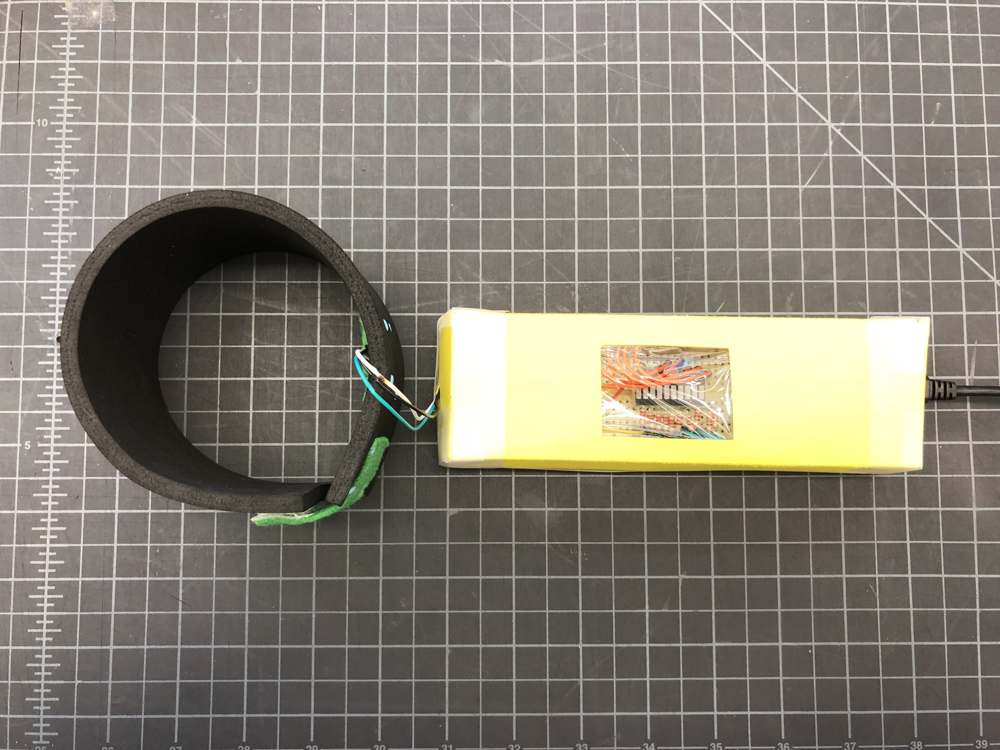
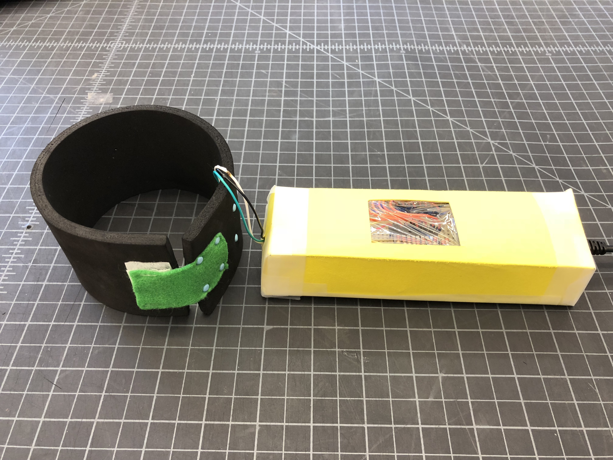
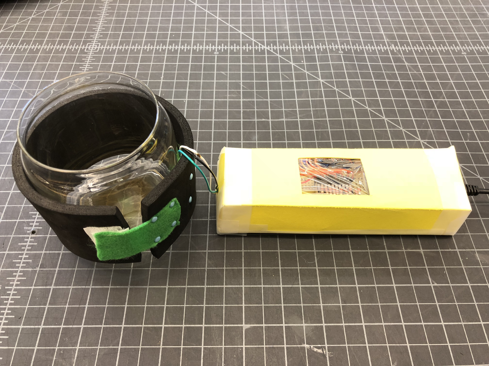

# Final Project Report: SAFE MUG
A mug that has a heat sensor and LED lights connected to it for the user to tell how hot their drink is without touching the mug.
## Summary
As a person who enjoys making and drinking hot tea, I sometimes get my mouth and hands burnt by the boiling hot water inside my mug because sometimes it is difficult to tell how hot the tea is without touching it first. In order to prevent that from happening in the future, I am planning to make a temperature detector for my mug that tells me how hot my drink is.
The detector will have a heat sensor and a 10 segment LED bargraph connected to it - depending on how high the temperature is, a number of lights will be turned and off. For example, if the temperature is below 30 °C, all lights will be turned on. If the temperature rises to 100 °C, only one light will be on. The closer the tea inside the mug is to a drinkable temperature (30 °C in my case), the more lights will be on. 
The temperaturedetector is a detachable device thermo sleeve that wraps around the mug, so it can be used on all types of mugs and glasses. 

## Component Parts
Hardware:
* Mug
* Temperature sensor
* 10 Segment LED Bargraph
* foam and fabric
* Arduino program 

## Block Diagram

## Challenges
I thought the hardest part was going to be incorporating the heat sensor in my program originally, but then it was fairly easy to connect it to my circuit. The most difficult issue that I encountered was that the code that I found for reading the temperature was in Fahrenheit, but I personally prefer to use Celsius, so I had to find the formula and convert the unit to Celsius. Writing the code for the lights was not too difficult, but it was pretty time-consuming to figure out which lights should light up for which temperatures. 
I found code to set up the bargraph and temperature reading, but I had to modify them in order to make the lights light up according to the different temperatures that I want. 

## Completion
Over all, my program is successful. I am aware of what I can do, so I did not risk to do anything that I would not be able to complete. After testing for more than a dozen times and presenting in class, I am sure that SAFE MUG works exactly the way I wanted it to. The only issue that I have with it is its look, which should not matter to much but still bothers me. Although this is not in my original plan, if I had more time and were able to find someone to teach me how to solder everything onto a smaller circuit board without breaking the Arduino, I would have tried to fit everything onto the thermo sleeve so it does not have to be so big.
